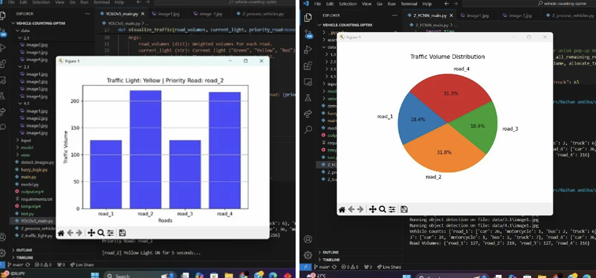

# AI-Powered Adaptive Traffic Control System (ATCS)


> A full-cycle simulation of an intelligent traffic control system. This project uses YOLOv5 for real-time vehicle detection, applies weighted logic to calculate traffic volume, and dynamically prioritizes traffic flow to reduce congestion.

This system is not just a detection script; it is an end-to-end simulation that proves the efficiency of an adaptive control system over traditional fixed-timer traffic lights, especially in high-density traffic.

---

## 1. Core Features

* **Weighted Vehicle Counting:** Detects 4 vehicle classes (car, bus, truck, motorcycle) and applies a custom weight to each (e.g., `car: 3`, `bus: 6`) to calculate a more accurate "traffic volume" score.
* **Dynamic Priority Logic:** The system identifies the road with the highest traffic volume score, prioritizes it for a green light, and then *recalculates* priorities for the remaining roads in an iterative loop.
* **Continuous Cycle Simulation:** Automatically processes image cycles (e.g., `image1.jpg`, `image2.jpg`...) for all 4 roads to simulate a continuous, real-time traffic monitoring feed.
* **Real-time Visualization:** Launches interactive `matplotlib` windows (Bar Chart & Pie Chart) to display the calculated traffic volumes and distribution for each road as the simulation runs.

## 2. System Architecture

The system's logic is cleanly separated into three main files:

1.  **`main.py` (The Brain 🧠):**
    * Runs the main program loop.
    * Manages the traffic light states (Green, Yellow, Red).
    * Handles the priority calculations and iterative logic.
    * Calls the visualization functions.
2.  **`process_vehicles.py` (The Eyes 👀):**
    * Calls the YOLOv5 detection model (`detect.py`'s `run` function) for each road's image.
    * Extracts the raw vehicle counts from the YOLOv5 output.
    * Passes the counts back to `main.py`.
3.  **`traffic_light.py` (The Calculator 🧮):**
    * Contains the core business logic.
    * `calculate_weighted_volume()`: Converts raw counts into a weighted score.
    * `allocate_traffic_light_times()`: Calculates green light duration based on the score.

## 3. Visual Demo & Output

When you run `main.py`, the system provides two real-time outputs: a detailed terminal log and live data visualizations.

| Terminal Log (Live Simulation) | Real-Time Bar Chart (Volume) | Real-Time Object Detection |
| :---: | :---: | :---: |
|  |  |  |
| A live feed showing vehicle counts, calculated volumes, and green light priority decisions. | A dynamic bar&pie chart showing the weighted traffic volume & Percentage for each road, updated every cycle. | A Yolov5 showing the object detection |

*(**Catatan:** Pastikan Anda sudah membuat folder `demo_assets` dan mengunggah screenshot Anda ke sana seperti yang kita diskusikan sebelumnya agar gambar-gambar ini muncul.)*

---

## 4. Model Fine-Tuning (The "Secret Sauce")

Through experimentation, default YOLOv5 settings were found to be suboptimal for dense Indonesian traffic. The following custom parameters were chosen to achieve **>95% accuracy** and superior performance over models like Faster RCNN in high-density scenarios.

* **`imgsz=(1280, 1280)`**: Increased image size from the default 640. This significantly improves accuracy in crowded scenes with many small, overlapping objects.
* **`conf_thres=0.10`**: A low confidence threshold to ensure the model detects as many potential objects as possible.
* **`iou_thres=0.2`**: A low IOU (Intersection over Union) threshold, which is critical for distinguishing between multiple, tightly-packed objects (like motorcycles) instead of merging them into one detection.

---

## 5. How to Run (Step-by-Step Guide)

This guide is based on the successful execution log and is optimized for an **NVIDIA (CUDA) GPU**.

### A. Go to the Correct Directory

All commands must be run from the `yolov5` folder where `main.py` is located.

```powershell
# Ganti dengan path absolut ke folder proyek Anda
cd C:\AI-Urban-Traffic-Controller\Traffic-Detection-YOLOV5\yolov5
```

### B. Setup Environment

1.  **(Optional Cleanup)** If a folder named `venv` already exists, remove it to start fresh:
    ```powershell
    Remove-Item -Recurse -Force venv
    ```

2.  **Create and activate a new virtual environment:**
    ```powershell
    python -m venv venv
    .\venv\Scripts\activate
    ```
    *(Your terminal prompt will now start with `(venv)`)*

### C. Install Dependencies (GPU Optimized)

This two-step process ensures the GPU version of PyTorch is installed *before* the other packages.

1.  **Install PyTorch (GPU Version):**
    ```powershell
    # This example is for CUDA 12.1. Check your NVIDIA driver and get the right command from the PyTorch website.
    pip install torch torchvision --index-url [https://download.pytorch.org/whl/cu121](https://download.pytorch.org/whl/cu121)
    ```

2.  **Install all other dependencies:**
    ```powershell
    pip install -r requirements.txt
    ```

### D. Run the Simulation!

You are now ready. Simply run `main.py`. The script will automatically find and use your GPU.

```powershell
(venv) PS C:\...[your-project-path]...\yolov5> python main.py
```

### E. Manual Detection (Stand-alone Demo)

If you want to bypass the full `main.py` simulation and test the YOLOv5 detection model on a single image or folder, you can call `detect.py` directly. This is useful for testing parameters in isolation.

1.  **Activate your virtual environment:**
    (Ensure you are in the correct project directory: `.../yolov5>`)
    ```powershell
    .\venv\Scripts\activate
    ```

2.  **Run the `detect.py` script:**
    The command below uses the **fine-tuned parameters** (from the project documentation) for high-density traffic and **forces the script to use your GPU** (`--device 0`).

    ```powershell
    # Example: Run detection on all images inside the 'data/1.1/' folder
    python detect.py --weights yolov5l.pt --imgsz 1280 1280 --conf-thres 0.10 --iou-thres 0.2 --device 0 --source data/1.1/
    ```

#### **Command Breakdown:**
* `--weights yolov5l.pt`: Uses the "Large" YOLOv5 model, which was specified for this project. The script will automatically download these weights if they are missing.
* `--imgsz 1280 1280`: Sets the image size to `1280x1280` for high-accuracy detection (upgraded from the default 640).
* `--conf-thres 0.10`: Uses the custom low confidence threshold to detect more objects.
* `--iou-thres 0.2`: Uses the custom low IOU threshold to distinguish between overlapping objects.
* `--device 0`: **Forces the script to run on your primary NVIDIA GPU (CUDA:0)** for fast processing.
* `--source data/1.1/`: Specifies the target folder to analyze.

#### **Expected Output:**
The script will run (very quickly on a GPU) and save the annotated output images (with bounding boxes) to a new folder, typically `runs/detect/exp`.
